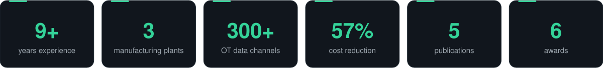
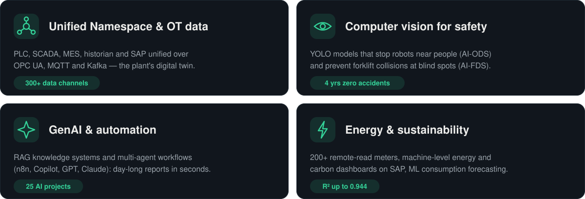
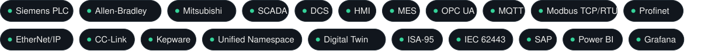

<a href="https://emrecancioglu.com">
  <picture>
    <source media="(prefers-color-scheme: dark)" srcset="assets/hero-dark.svg" />
    <source media="(prefers-color-scheme: light)" srcset="assets/hero-light.svg" />
    
  </picture>
</a>

  
  
  
  
  

<picture>
    <source media="(prefers-color-scheme: dark)" srcset="assets/stats-dark.svg" />
    <source media="(prefers-color-scheme: light)" srcset="assets/stats-light.svg" />
    
  </picture>

### 👋 About me

I lead **OT digitalization** and **applied-AI** strategy across 3 battery manufacturing plants at **İnci GS Yuasa** — managing a 2-person engineering team, coordinating 10+ departments, and running the company-wide **AI Ambassador** program. I work where the shop floor meets software: PLCs, SCADA and industrial protocols on one side; Node.js/React, cloud and machine learning on the other.

🌐 Full resume, publications and awards → **[emrecancioglu.com](https://emrecancioglu.com)** · Türkçe → **[emrecancioglu.com/tr](https://emrecancioglu.com/tr)**

### 🏭 What I build

<picture>
    <source media="(prefers-color-scheme: dark)" srcset="assets/build-dark.svg" />
    <source media="(prefers-color-scheme: light)" srcset="assets/build-light.svg" />
    
  </picture>

### 🧭 Career

<picture>
    <source media="(prefers-color-scheme: dark)" srcset="assets/timeline-dark.svg" />
    <source media="(prefers-color-scheme: light)" srcset="assets/timeline-light.svg" />
    
  </picture>

### 🛠️ Tech stack

**OT &amp; industrial systems**

<picture>
    <source media="(prefers-color-scheme: dark)" srcset="assets/ot-dark.svg" />
    <source media="(prefers-color-scheme: light)" srcset="assets/ot-light.svg" />
    
  </picture>

**Software · Data &amp; AI · Cloud**

  <picture>
    <source media="(prefers-color-scheme: dark)" srcset="assets/stack-dev-dark.svg" />
    <source media="(prefers-color-scheme: light)" srcset="assets/stack-dev-light.svg" />
    
  </picture> 
  <picture>
    <source media="(prefers-color-scheme: dark)" srcset="assets/stack-data-dark.svg" />
    <source media="(prefers-color-scheme: light)" srcset="assets/stack-data-light.svg" />
    
  </picture> 
  <picture>
    <source media="(prefers-color-scheme: dark)" srcset="assets/stack-cloud-dark.svg" />
    <source media="(prefers-color-scheme: light)" srcset="assets/stack-cloud-light.svg" />
    
  </picture>

### 📚 Publications

| Year | Title | Venue |
|:---:|---|---|
| 2026 | Energy consumption forecasting on battery production lines (XGBoost · LightGBM · GBM, R² up to 0.944) | 13th International European Conference on Interdisciplinary Scientific Research, Tirana |
| 2024 | Data integration for Industry 4.0 &amp; IIoT: Unified Namespace–based digital transformation with MQTT, OPC UA and Node.js | R&amp;D &amp; Innovation 2024 |
| 2021 | Fault detection and diagnosis on process control systems using ensemble learning from Poincaré plot measures | European Journal of Science and Technology, 26 · [DOI](https://doi.org/10.31590/ejosat.952761) |
| 2020 | LSTM-based heart sound analysis and classification | Journal of Intelligent Systems and Applications, 3(1) |

### 🏆 Recognition

- 🥇 **1st Place**, Cevdet İnci Incentive Awards — 2023, 2024, 2025 · 💡 **Innovation Special Award** — 2024
- ⭐ **İnci GS Yuasa Stars** — 1st Place 2024, 3rd Place 2025
- 🌱 **Finalist**, Sustainability Business Awards (Technology &amp; AI) — 2025

  
<b>📈 GitHub activity</b>

   
  

    <picture>
      <source media="(prefers-color-scheme: dark)" srcset="https://raw.githubusercontent.com/emrecancioglu7/emrecancioglu7/output/github-snake-dark.svg" />
      <source media="(prefers-color-scheme: light)" srcset="https://raw.githubusercontent.com/emrecancioglu7/emrecancioglu7/output/github-snake.svg" />
      
    </picture>
  

  

    
  

<picture>
    <source media="(prefers-color-scheme: dark)" srcset="assets/footer-dark.svg" />
    <source media="(prefers-color-scheme: light)" srcset="assets/footer-light.svg" />
    
  </picture>

